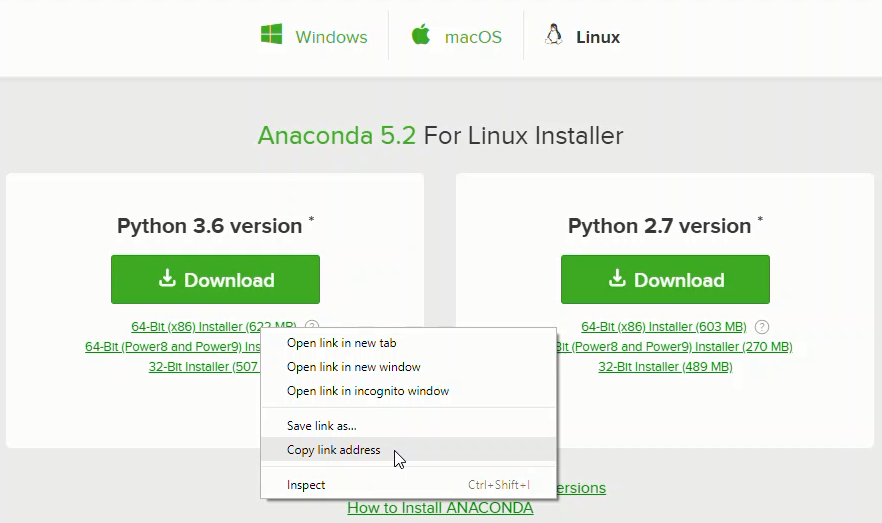

---
jupytext:
  text_representation:
    extension: .md
    format_name: myst
    format_version: '0.9'
    jupytext_version: 1.5.0
kernelspec:
  display_name: Python 3
  language: python
  name: python3
---

# Installing Anaconda on Linux

+++

This section details the installation of the Anaconda distribution of Python on Linux, specifically Ubuntu 18.04, but the instructions should work for other Debian-based Linux distributions as well.

Ubuntu 18.04 comes pre-installed with Python (Version 3.6) and legacy Python (Version 2.7). You can confirm the legacy version of Python is installed by opening up a terminal.

In the terminal type:

```text
$ python
```

You will most likely see Python Version 2.7 is installed. If you enter:

```text
$ python3
```

You will most likely see Python Version 3.6 is also installed. You can use the 3.6 Version of Python, but each time a new package needs to be downloaded, the ```$ pip3 install``` command must be used.

Install the Anaconda distribution of Python to follow the examples in the book without the need to install additional third-party packages.

+++

## Steps:

1. Visit [Anaconda.com/downloads](https://www.anaconda.com/download/)

2. Select Linux

3. Copy the bash (.sh file) installer link

4. Use ```wget``` to download the bash installer

5. Run the bash script to install **Anaconda3**

6. ```source``` the ```.bash-rc``` file to add Anaconda to your ```PATH```

7. Start the Python REPL

+++

### 1. Visit the Anaconda downloads page

Go to the following link: [Anaconda.com/downloads](https://www.anaconda.com/download/)

+++

### 2. Select Linux

On the downloads page, select the Linux operating system


+++

### 3. Copy the bash (.sh file) installer link

In the **Python 3.6 Version* ** box, right-click on the [64-Bit(x86) Installer] link. Select [copy link address].



+++

### 4. Use ```wget``` to download the bash installer

Now that the bash installer (.sh file) link is stored on the clipboard, use ```wget``` to download the installer script. In a terminal, ```cd``` into the home directory and make a new directory called ```tmp```. ```cd``` into ```tmp``` and use ```wget``` to download the installer. Although the installer is a bash script, it is still quite large and the download will not be immediate (Note the link below includes ```<release>```. the specific release depends on when you download the installer).

```text
$ cd ~
$ mkdir tmp
$ cd tmp
$ https://repo.continuum.io/archive/Anaconda3<release>.sh
```

+++

### 5. Run the bash script to install **Anaconda3**

With the bash installer script downloaded, run the **_.sh_** script to install **Anaconda3**. Ensure you are in the directory where the installer script downloaded:

```text
$ ls
Anaconda3-5.2.0-Linux-x86_64.sh
```

Run the installer script with bash.

```text
$ bash Anaconda3-5.2.0-Linux-x86_64.sh
```

Accept the Licence Agreement and allow Anaconda to be added to your ```PATH```. By adding Anaconda to your ```PATH```, the Anaconda distribution of Python will be called when you type ```$ python``` in a terminal.

+++

###  6. ```source``` the ```.bash-rc``` file to add Anaconda to your ```PATH```

Now that **Anaconda3** is installed and **Anaconda3** is added to our ```PATH```, ```source``` the ```.bashrc``` file to load the new ```PATH``` environment variable into the current terminal session. Note the ```.bashrc``` file is in the home directory. You can see it with ```$ ls -a```.

```text
$ cd ~
$ source .bashrc
```

+++

### 7. Start the Python REPL

To verify the installation is complete, open Python from the command line:

```text
$ python

Python 3.6.5 |Anaconda, Inc.| (default, Mar 29 2018, 18:21:58)
[GCC 7.2.0] on linux
Type "help", "copyright", "credits" or "license" for more information.
>>>
```

If you see Python 3.6 from Anaconda listed, your installation is complete. To exit the Python REPL, type:

```text
>>> exit()
```
